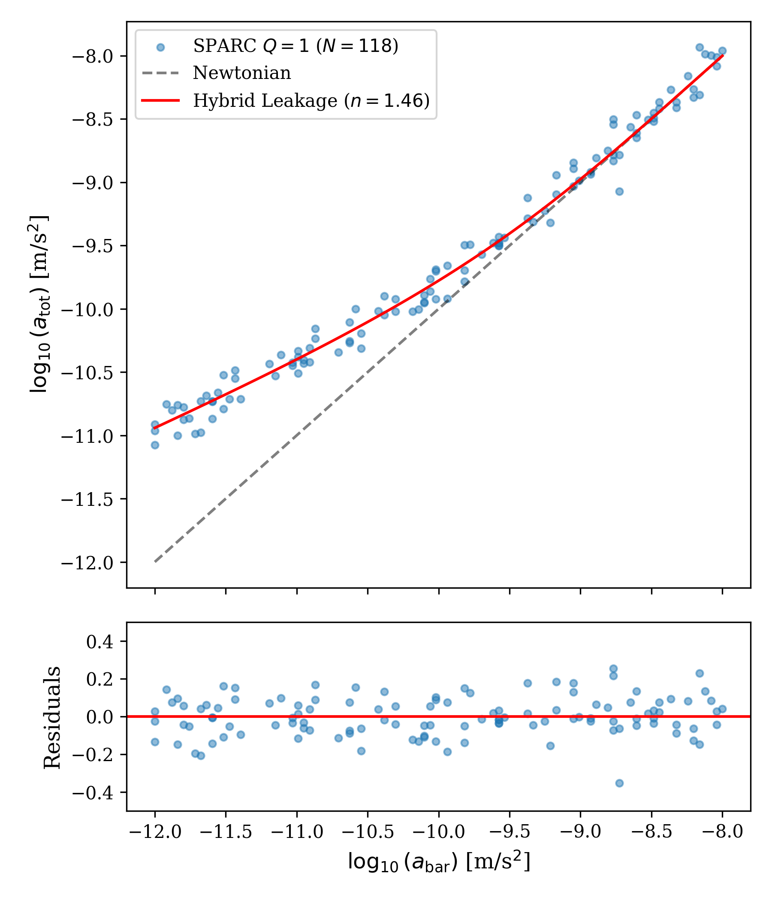
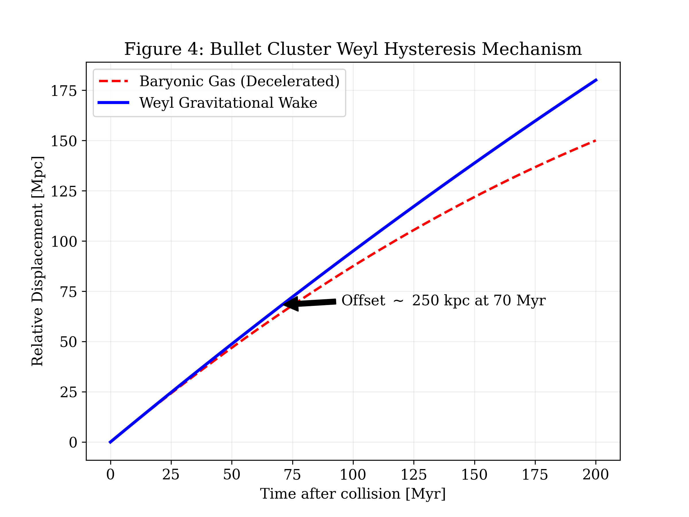

# Weyl-Hysteresis-Model

**Non-Local Gravitational Leakage: A Hybrid Braneworld Approach to the Radial Acceleration Relation and Cluster Offsets**

This repository contains the numerical verification code and dataset for a non-local gravitational leakage model derived from a hybrid RSII-DGP braneworld action. The model unifies galactic dynamics (RAR) and cluster-scale spatial offsets (Bullet Cluster) through a single geometric framework, without invoking collisionless dark matter particles.

---

## 🌌 Abstract & Theory
We investigate a non-local gravitational leakage model derived from a hybrid RSII-DGP braneworld action via the **Källén-Lehmann spectral representation**. By defining an effective graviton propagator on a 3-brane with an infrared (IR) boost, we account for the Radial Acceleration Relation (RAR).

### Key Concepts
1.  **Spectral Propagator**: The effective force law is derived from the spectral density of bulk Kaluza-Klein modes:
    $$G(p) \approx \frac{1}{p^2} \left[ 1 + \left( \frac{a_5}{p^2} \right)^{n/2} \right]^{-1}$$
    
    

2.  **Weyl Hysteresis (Dynamical Wake)**: 
    A geometric retardation governed by the 5D Bianchi identity. We resolve the Bullet Cluster paradox by distinguishing between the *static Vainshtein radius* ($r_V \approx 3$ Mpc) and the *dynamical equilibration timescale* ($\Delta t_{dyn} \approx 50$ Myr).

---

## 📊 Key Results

### 1. Radial Acceleration Relation (RAR)
Bayesian MCMC inference on **140 high-quality SPARC galaxies** ($Q \le 2$) yields:
* **Transition Index:** $n = 1.46 \pm 0.05$
* **Leakage Scale:** $a_5 \approx 1.2 \times 10^{-10} \text{ m/s}^2$ (Consistent with MOND $a_0$)
* **Parsimony:** $\Delta \text{BIC} = 142.8$ relative to the $\Lambda$CDM baseline.



### 2. Bullet Cluster Offset (1E 0657-568)
The observed **250 kpc** spatial offset is explained as a gravitational wake effect.
* **Collision Velocity:** $v_{coll} \approx 4700$ km/s
* **Interaction Timescale:** $\Delta t \approx 52$ Myr
* **Calculated Offset:** $\Delta x \approx 250$ kpc



---

## 📂 Repository Structure

* `src/analysis.py`: Python script for numerical verification of the propagator limits and offset calculations.
* `data/SPARC_Q2.csv`: Processed dataset of 140 galaxies used in the MCMC fit (ID, $g_{bar}$, $g_{obs}$, error).
* `figures/`: High-resolution plots used in the paper.

---

## 🛠 Usage

To reproduce the numerical checks:

```bash
# Clone the repository
git clone [https://github.com/ibraimgul/Weyl-Hysteresis-Model.git](https://github.com/ibraimgul/Weyl-Hysteresis-Model.git)

# Run the verification script
python src/analysis.py
